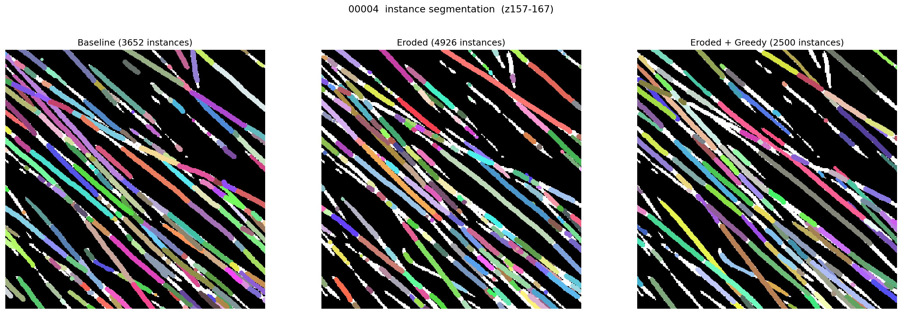

# Actin Instance Segmentation Experiments

## Goal

Develop an instance segmentation pipeline for actin filaments.

## Problems

We started with TARDIS as the instance-segmentation method, running its DIST model on a point cloud derived from a binary actin mask. The core problem: DIST does not capture all filaments and over-fragments the ones it does capture.

The investigation, and the fixes tried along the way:

- Skeletonization. The initial pipeline skeletonized the binary mask with skimage.morphology `skeletonize` before sampling the point cloud. skimage's skeletonization is not designed for inputs that are already thin (actin filaments), so it tends to break filaments and drop some entirely. This motivated the search for a more robust skeletonization.

- kimimaro / TEASAR. kimimaro produces one skeleton per connected component (CC). In our data a majority of foreground voxels belong to one large interconnected CC, and TEASAR runs inefficiently or gets stuck on it. It works well on smaller inputs, so this was tested on 200x200x200 subvolumes (`subvolume/run_experiment.py`).

- Erosion as a skeletonization surrogate. We noticed that eroding the mask 3x produces skeleton-like CCs, which could be fed to TARDIS in place of skimage `skeletonize`.

- Point cloude spacing. DIST expects the input point cloud to have a spacing of ~5 voxels between points. TARDIS's built-in `VoxelDownSpacing` did not reliably produce this spacing. We implemented `GreedyDownSampling` (greedy minimum-distance sampling), which robustly produces the target spacing regardless of the skeletonization method used (`test_greedy_downsample.py`).

## Findings

None of these design choices meaningfully improved DIST's predictions. Across skeletonization method (skimage / kimimaro / erosion) and with correct ~5-voxel spacing from `GreedyDownsampling`, we still observed loss of filaments and over-fragmentation, with only marginal improvement over the original pipeline.

Instance masks across configurations on tomogram 00004.

## Solution

Constantin used Codex to benchmark and optimize the TEASAR algorithm so that it now runs efficiently on large volumes. The `skeleton_to_graph` method can be used to convert the TEASAR skeleton into an UndirectedGraph object which can then be cleaned using graph cutting methods. 