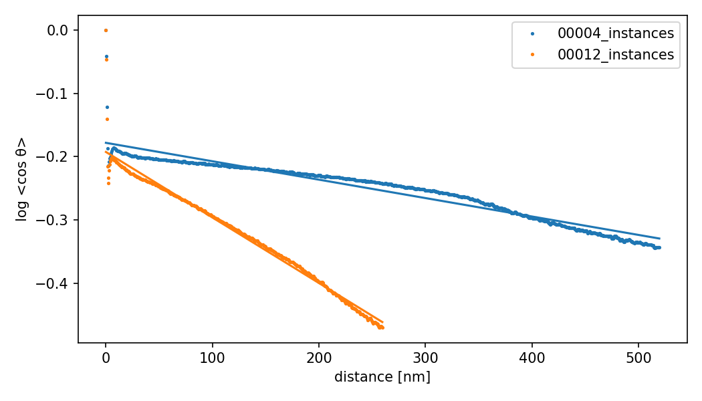
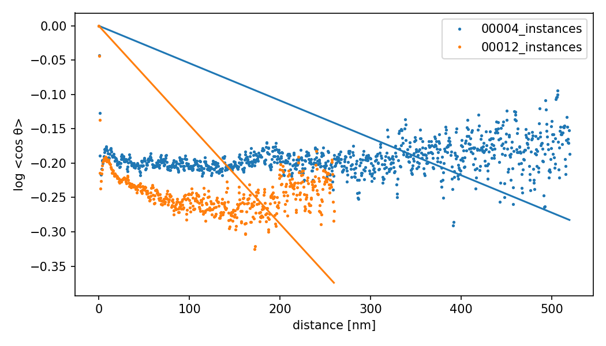
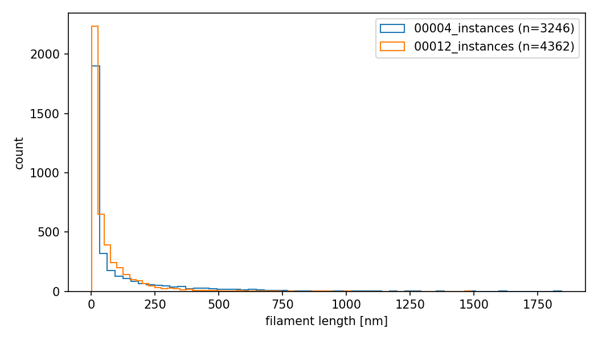

# Persistence length: method comparison

Compare two persistence-length (Lp) estimators on deepict tomograms 00004 and 00012. R²
reports the fit quality of each method.

## Input

Both methods read the instance point clouds written by `predict_actin_instances.py`, one
CSV per tomogram (`<tomogram>_instances.csv`) with columns `ID,X,Y,Z`:

- `ID` is a connected-component label; one filament per `ID`.
- `X,Y,Z` are skeleton graph vertex coordinates in `--pixel_size` units (Angstrom; 10 A for
  deepict), not raw segmentation voxels.
- Rows within an `ID` are ordered along the filament, so consecutive rows are adjacent
  skeleton points and tangents follow the contour.

`predict_actin_instances.py` builds the clouds from the binary segmentation by teasar
skeletonization, `clean_filament_graph` (split, prune, join), and `connected_components`.

## Methods

Method 1 — port of Bäuerlein et al. (Cell 2017)
(`persistence_length_bauerlein.py`):

- Reference tangent is each filament's middle tangent; correlate it with the tangent at each
  offset along both arms.
- Uses the unsigned acute angle, so `cos θ` stays in [0, 1].
- Fits `log<cos θ>` through the origin (intercept fixed at 0), up to the P90 filament length.

Method 2 — robust version (`pipeline_scripts/analysis/persistence_length.py`):

- All-pairs autocorrelation: average the signed tangent dot product over every point pair at
  each separation.
- Fits `log<cos θ> = ln(A) - s / Lp` with a free intercept, up to the P90 filament length
  (via `max_lag`); the intercept absorbs the `s = 0` decorrelation from skeleton
  discretization.

Both resample to `--sampling_dist` (5 A) and drop filaments shorter than `--min_length`
(350 A = 35 nm).

## Run

```
python pipeline_scripts/analysis/persistence_length.py \
  --data_dir data/predictions/deepict/instances --pattern "*/*_instances.csv" \
  --results_dir experiments/persistence_length/results --tag deepict --min_length 350
python experiments/persistence_length/persistence_length_bauerlein.py \
  --data_dir data/predictions/deepict/instances --pattern "*/*_instances.csv" \
  --results_dir experiments/persistence_length/results --tag deepict --min_length 350
```

## Results

`n` is the number of filaments kept after the length cutoff and used in the fit.
Persistence length in µm, with fit R². Method 1 is the through-origin fit (Bäuerlein);
Method 2 is the free-intercept fit.

Cutoff 350 A (35 nm):

| sample | n    | Method 1 Lp | R²    | Method 2 Lp | R²    |
|--------|------|-------------|-------|-------------|-------|
| 00004  | 1301 | 1.84        | -19.8 | 3.44        | 0.932 |
| 00012  | 1834 | 0.69        | -18.1 | 0.97        | 0.975 |

Cutoff 2000 A (200 nm):

| sample | n   | Method 1 Lp | R²   | Method 2 Lp | R²    |
|--------|-----|-------------|------|-------------|-------|
| 00004  | 500 | 2.87        | -6.8 | 2.73        | 0.966 |
| 00012  | 309 | 1.39        | -3.7 | 0.92        | 0.994 |


### Plots

Both fit plots share axes (log <cos θ> vs distance in nm), so they are directly comparable.

Method 2 (free intercept):



Method 1 (through origin, Bäuerlein):



Filament length distribution:



## Interpretation

Method 2 (free-intercept) fits well at both cutoffs (R² 0.93 to 0.99). Method 1
(through-origin) fits poorly (negative R²); it improves at the 2000 A cutoff but stays below
zero. Forcing the intercept to 0 does not match the measured decay, so the Method 1 Lp is
not trustworthy on this data.

Method 2 gives 00004 Lp 3.44 µm at the 350 A cutoff and 2.73 µm at 2000 A, near the reported
stress-fiber value of 3.7 µm; 00012 gives about 0.9 to 1.0 µm. Lp exceeds the longest
filaments (about 1.8 µm), so the fit extrapolates beyond the measured contour range. The
high R² still makes Method 2 the more reliable estimate.
