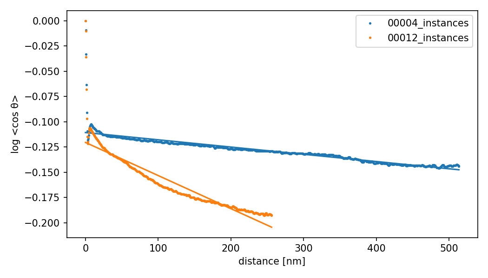
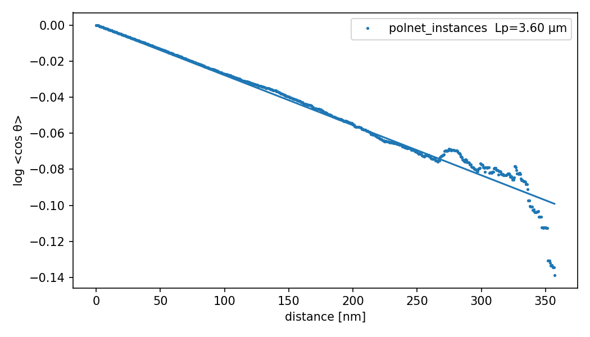
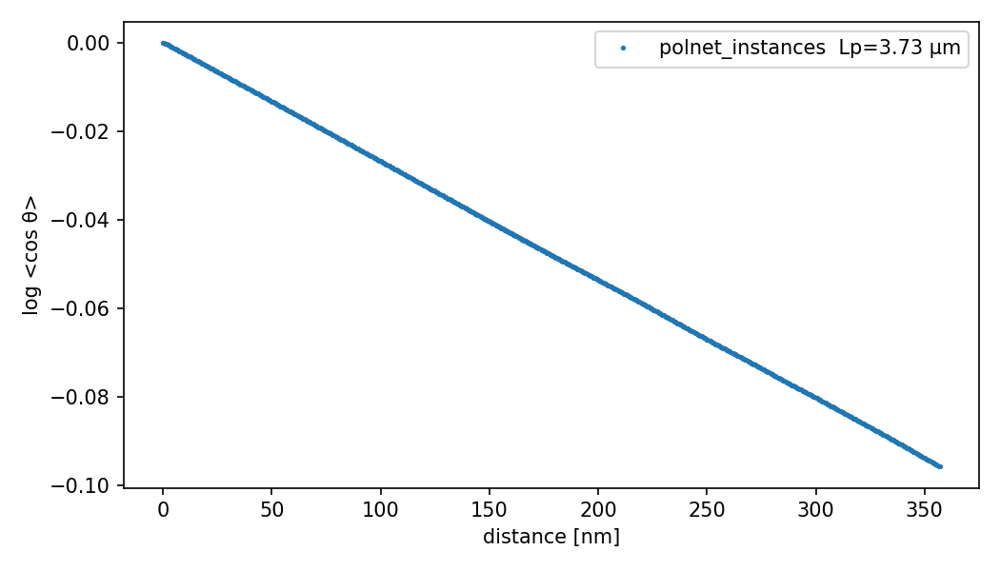

# Persistence Length Experiments

Estimate the actin persistence length (Lp) two ways and check them against ground truth.
Two experiments: Deepict tomograms (real data) and PolNet simulations (known Lp).

## Deepict

### Inputs

Both methods read the instance point clouds written by `predict_actin_instances.py`, one
CSV per tomogram (`<tomogram>_instances.csv`) with columns `ID,X,Y,Z`:

- `ID` is a connected-component label; one filament per `ID`.
- `X,Y,Z` are skeleton graph vertex coordinates in `--pixel_size` units (10 A).
- Rows within an `ID` are ordered along the filament.

`predict_actin_instances.py` builds the clouds from the binary segmentation by teasar
skeletonization, `clean_filament_graph` (split, prune, join), and `connected_components`.

### Methods

Method 1 — port of Bäuerlein et al. (Cell 2017) (`persistence_length_bauerlein.py`):

- Reference tangent is each filament's middle tangent; correlate it with the tangent at each
  offset along both arms.
- Uses the unsigned acute angle, so `cos θ` stays in [0, 1].
- Fits `log<cos θ>` through the origin (intercept fixed at 0), up to the P90 filament length.

Method 2 — robust (`pipeline_scripts/analysis/persistence_length.py`):

- All-pairs autocorrelation: average the signed tangent dot product over every point pair at
  each separation.
- The tangent at each point is averaged over `--tangent_window` adjacent points (default 5)
  to reduce aliasing.
- Fits `log<cos θ> = ln(A) - s / Lp` with a free intercept, up to the P90 filament length
  (via `max_lag`).

Both resample to `--sampling_dist` (5 A) and drop filaments shorter than `--min_length`
(350 A = 35 nm).

### Results

`n` is the number of filaments kept after the length cutoff and used in the fit.
Persistence length in µm, with fit R².

Cutoff 350 A (35 nm):

| sample | n    | Method 1 Lp  | R²    | Method 2 Lp  | R²    |
|--------|------|--------------|-------|--------------|-------|
| 00004  | 1301 | 1.84         | -19.8 | 3.41         | 0.953 |
| 00012  | 1834 | 0.69         | -18.1 | 1.00         | 0.987 |

Both fit plots share axes (log <cos θ> vs distance in nm), so they are directly comparable.

Method 1 (Bäuerlein):

Method 2 (robust):

Filament length distribution:

### Interpretation

robust fits well at both cutoffs (R² 0.95 to 0.99). Bäuerlein fits poorly (negative R²);
forcing the intercept to 0 does not match the measured decay, so the Bäuerlein Lp is not
trustworthy here.

### Merged filaments

`detect_merged_filaments.py` flags instances that `clean_filament_graph` did not split. An
instance whose skeleton graph has a node of degree >= 3 is a branch (3) or crossing (4) that
merges two filaments under one ID. The script reports the graph degree, the maximum turning
angle between consecutive tangents, and `gap_ratio` (the largest step over the median step),
then writes clean CSVs with the suspects removed.

At the 350 A cutoff:

| sample | filaments | suspect | degree 3 | degree 4 |
|--------|-----------|---------|----------|----------|
| 00004  | 1301      | 11      | 8        | 3        |
| 00012  | 1834      | 9       | 0        | 9        |

The two failure modes separate by geometry:

- Degree-4 crossings show a near-180° turn and a large spatial gap (gap_ratio up to 525),
  because the ordered walk jumps to the second, separated filament.
- Degree-3 branches show a moderate turn (76-97°) with a small gap.

Effect on the robust fit (350 A), suspects removed:

| sample | Lp all | R² all | Lp clean | R² clean |
|--------|--------|--------|----------|----------|
| 00004  | 3.41   | 0.95   | 13.94    | 0.77     |
| 00012  | 1.00   | 0.99   | 3.05     | 0.84     |

Only about 1% of instances are merged. They are among the longest (merged length up to about
1800 nm), and their near-180° reversals inject spurious anti-correlation. Removing them
changes Lp several-fold and lowers R². The fit is ill-conditioned: the true Lp is far larger
than the observable filament length, so Lp is not robustly determined. Screen for merged
filaments before trusting any value.

## Polnet Simulations - Ground Truth

### Inputs

- Source: Polnet simulation `deepict_dataset_7`, condition 0 (`simulation_dir_0`), 15 tomos.
- Ground truth: actin coordinates in `motif_lists/tomo_motif_list_*.csv`.
- Simulated persistence length: 3.7 µm.
- Preparation: `prepare_polnet_gt.py` converts the motif lists to the `ID,X,Y,Z` format for
  the persistence length scripts.

### Results

Pooled actin, `--min_length 350`. Persistence length in µm.

| source     | n    | Method 1 Lp  | R²    | Method 2 Lp | R²    |
|------------|------|--------------|-------|-------------|-------|
| GT         | 9643 | 3.60         | 0.965 | 3.73        | 1.000 |

Both methods recover the 3.7 µm ground truth on clean data. robust is nearly exact
(3.73 µm, R² 1.000); Bäuerlein is close (3.60 µm). The through-origin fit works here because
the ground-truth filaments are long and clean, unlike the fragmented Deepict skeletons.

Method 1 (Bäuerlein):

Method 2 (robust):

